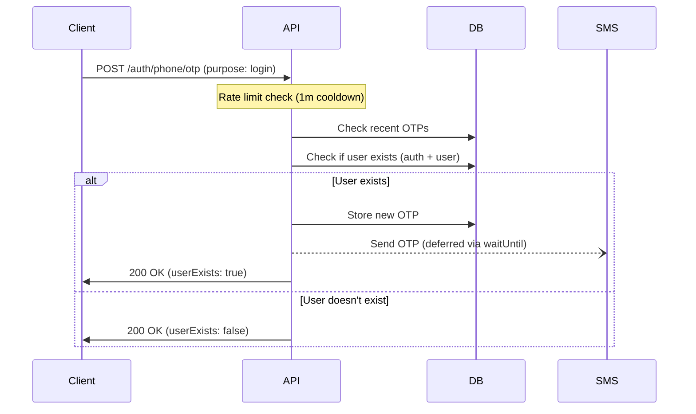
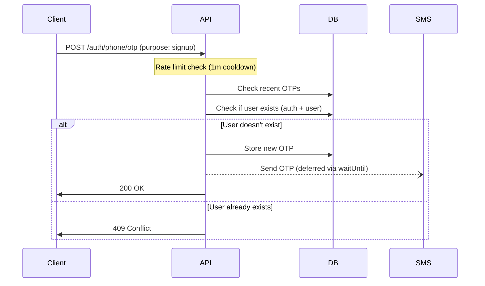
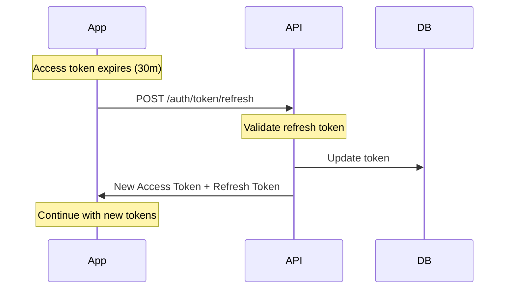
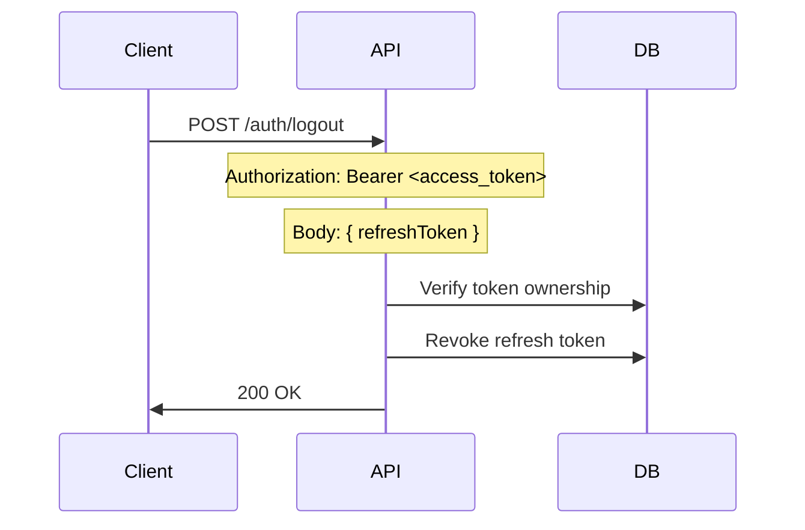

# Authentication Guide

## Authentication System

The Hono API implements a mobile-first authentication strategy using access tokens and refresh tokens.

### Authentication Lifecycle

#### 1. Initial Authentication

**Phone/OTP Flow:**

**Login Flow:**



---

**Signup Flow:**



    Client->>API: POST /auth/phone/signup or /auth/phone/login
    Note over API: Validate OTP (max 3 attempts)
    API->>DB: Check OTP
    API->>DB: Create auth + user records
    API->>Client: Access Token + Refresh Token

````

**OAuth Flow (Google/Apple):**

```mermaid
sequenceDiagram
    participant Client
    participant API
    participant DB

    Client->>API: POST /auth/google or /auth/apple (idToken)
    API->>DB: Check if user exists by (provider, provider_id)

    alt User exists
        API->>Client: Access Token + Refresh Token
    else New user
        API->>Client: needsSignup: true (provider info)
        Client->>Client: Show signup form
        Client->>API: POST /auth/oauth/signup (name, gender, birthYear)
        API->>DB: Check email conflict
        API->>DB: Create auth + user records
        API->>Client: Access Token + Refresh Token
    end
````

#### 2. Access Token Validation (Middleware Flow)

```mermaid
sequenceDiagram
    participant Client
    participant API
    participant DB

    Client->>API: GET /user/profile (Authorization: Bearer <access_token>)
    Note over API: Verify JWT signature & expiry
    API->>DB: Check user exists
    Note over API: Set user context
    API->>Client: 200 OK with data
```

#### 3. Token Refresh Flow



#### 4. Logout Flow



## Code Organization

- **Business logic handlers** live in `src/handlers` (e.g., `users`, `upload`, etc.)
- **Cross-cutting/auth-only logic** lives in `src/modules/auth` (handlers, middleware, config, types)
- **Shared middlewares** in `src/middlewares`, **shared utilities** in `src/utils`, **external adapters** in `src/adapters`
- **Shared types** are defined in the `@the/types` package and imported where needed
- This separation keeps business routes independent from authentication internals and avoids tight coupling

### API Reference

#### OTP Request

`POST` `/auth/phone/otp`

```json
// Request
{
	"phone": "9876543210",
	"purpose": "login" // or "signup"
}

// Response for signup purpose (user doesn't exist)
{
	"userExists": false
}

// Response for signup purpose (user already exists)
{
	"error": "User already exists. Please login instead.",
	"code": "CONFLICT"
}

// Response for login purpose (user exists)
{
	"userExists": true
}

// Response for login purpose (user doesn't exist)
{
	"userExists": false
}
```

#### Signup

`POST` `/auth/phone/signup`

```json
// Request
{
	"phone": "9876543210",
	"code": "123456",
	"name": "John Doe",
	"gender": "male",
	"birthYear": 1990,
	"deviceInfo": {
		"os": "ios",
		"osVersion": "17.0",
		"model": "iPhone 15 Pro",
		"brand": "Apple",
		"deviceYearClass": 2023,
		"appVersion": "1.0.0",
		"buildNumber": "1"
	}
}

// Response
{
	"accessToken": "eyJ...",
	"refreshToken": "tz4a98xxat96iws9zmbrgj3a"
}
```

#### Login

`POST` `/auth/phone/login`

```json
// Request
{
	"phone": "9876543210",
	"code": "123456",
	"deviceInfo": {
		"os": "ios",
		"osVersion": "17.0",
		"model": "iPhone 15 Pro",
		"brand": "Apple",
		"deviceYearClass": 2023,
		"appVersion": "1.0.0",
		"buildNumber": "1"
	}
}

// Response
{
	"accessToken": "eyJ...",
	"refreshToken": "tz4a98xxat96iws9zmbrgj3a"
}
```

#### Token Refresh

`POST` `/auth/token/refresh`

```json
// Request
{
	"refreshToken": "tz4a98xxat96iws9zmbrgj3a"
}

// Response
{
	"accessToken": "eyJ...",
	"refreshToken": "tz4a98xxat96iws9zmbrgj3a"
}
```

#### Google Sign-In

`POST` `/auth/google`

```json
// Request
{
	"idToken": "eyJ...",
	"deviceInfo": { ... }
}

// Response (existing user)
{
	"accessToken": "eyJ...",
	"refreshToken": "tz4a98xxat96iws9zmbrgj3a"
}

// Response (new user - needs signup)
{
	"needsSignup": true,
	"provider": "google",
	"providerId": "google_user_id_123",
	"email": "user@gmail.com"
}
```

#### Apple Sign-In

`POST` `/auth/apple`

```json
// Request
{
	"idToken": "eyJ...",
	"deviceInfo": { ... }
}

// Response (existing user)
{
	"accessToken": "eyJ...",
	"refreshToken": "tz4a98xxat96iws9zmbrgj3a"
}

// Response (new user - needs signup)
{
	"needsSignup": true,
	"provider": "apple",
	"providerId": "apple_user_id_456",
	"email": "user@privaterelay.appleid.com" // or null
}
```

#### OAuth Signup Completion

`POST` `/auth/oauth/signup`

```json
// Request
{
	"provider": "google",
	"providerId": "google_user_id_123",
	"email": "user@gmail.com",
	"name": "John Doe",
	"gender": "male",
	"birthYear": 1990,
	"deviceInfo": { ... }
}

// Response
{
	"accessToken": "eyJ...",
	"refreshToken": "tz4a98xxat96iws9zmbrgj3a"
}
```

#### Logout

`POST` `/auth/logout` _(Requires Authorization: Bearer token)_

```json
// Request
{
	"refreshToken": "tz4a98xxat96iws9zmbrgj3a"
}

// Response
{
	"message": "Logged out"
}
```

### Security Features

#### Token Security

- **Access tokens**: Short-lived (30 minutes) JWT tokens with HS256 algorithm for API access
- **Refresh tokens**: Long-lived (30 days) cryptographically secure 24-character base36 strings using 128-bit entropy
- **Token refresh**: Tokens are refreshed to prevent replay attacks
- **Cooldown protection**: Prevents rapid token refresh abuse (5-minute cooldown)

#### OTP Security

- **Rate limiting**: 1-minute cooldown between OTP requests
- **Attempt limiting**: Maximum 3 failed attempts per OTP
- **Automatic cleanup**: Expired or exhausted OTPs are automatically deleted
- **Secure generation**: Uses Web Crypto API for cryptographically secure OTP generation
- **SMS integration**: Real HTTP calls to BulkSMSBD API with proper error handling
- **Development mode**: OTPs logged to console instead of sending SMS in development
- **Purpose-based logic**:
  - **Signup**: Checks if user exists first, returns error if user already exists, otherwise sends OTP
  - **Login**: Checks if user exists first, only sends OTP if user exists

#### Database Security

- **Token revocation**: Tokens can be marked as revoked for immediate invalidation
- **Cascade deletion**: User deletion automatically cleans up all associated tokens
- **Activity tracking**: Last used timestamps for security monitoring
- **Device info storage**: Device information stored as JSONB for flexible metadata

### Implementation Details

#### Token Generation

- **Access tokens**: JWT with HS256 algorithm, 30-minute expiry
- **Refresh tokens**: Cryptographically secure 24-character base36 strings using 128-bit entropy

#### Database Schema

**`auth` table** - Core authentication data:

- `id` (primary key)
- `provider` (enum: phone, google, apple) - One provider per user
- `identifier` (not null) - Phone number (for phone) or OAuth provider ID (for google/apple)
- `email` (unique, nullable) - Primary email from OAuth providers
- Constraints: Unique `(provider, identifier)`, unique `email`

**`users` table** - User profile data (name, gender, birth year)

**`tokens` table** - Refresh token storage with device info (JSONB) and activity tracking

**`otps` table** - Temporary OTP storage with rate limiting

**OAuth Architecture:**

- One provider per user - simple, clear, no account linking complexity
- No schema migrations needed when adding new providers (just update enum)
- Email conflicts handled gracefully with user-friendly error messages

#### Error Handling

- **Graceful degradation**: Expired tokens return 401 without logging (normal behavior)
- **Security logging**: Only actual security issues are logged
- **Background cleanup**: Database operations use `waitUntil` for performance

### Middleware Authentication Flow

The `requireAuth` middleware is applied to all protected routes and performs the following validation:

1. **Extract Bearer Token**: Checks for `Authorization: Bearer <token>` header
2. **JWT Verification**: Verifies token signature and checks expiry using `hono/jwt`
3. **User Validation**: Ensures the user still exists in the database
4. **Context Setting**: Sets `c.set("user", { id: userId })` for route handlers
5. **Error Handling**: Returns appropriate error responses for invalid/expired tokens

#### Example Protected Route

```typescript
// Route handler with authentication
const getUserProfile = async (c: Context) => {
	const userId = c.get("user").id // From requireAuth middleware
	// ... business logic
}

// Register with middleware
app.get("/user/profile", requireAuth, getUserProfile)
```

### Mobile Client Integration

#### Token Storage

- Store both access token and refresh token securely
- Access token for API requests
- Refresh token for token renewal

#### Token Refresh Strategy

- Monitor access token expiry
- Use refresh token to get new tokens before expiry
- Handle refresh failures gracefully (redirect to login)

#### Logout Implementation

- Send refresh token to logout endpoint
- Clear local token storage
- Handle 401 responses by redirecting to login

#### Device Info

The API now stores comprehensive device information as JSONB, including:

- Operating system and version
- Device model and brand
- Device year class
- App version and build number

This enables better security monitoring and user experience personalization.

## Adding New OAuth Providers

1. **Add to enum:**

   ```typescript
   export const authProviderEnum = pgEnum("auth_provider", ["phone", "google", "apple", "facebook"])
   ```

2. **Create handler** (copy Google/Apple handler, change provider name)

3. **Register route:**
   ```typescript
   app.post("/auth/facebook", validate(facebookSignInSchema), facebookSignIn)
   ```

**No database migration needed!** The schema already supports unlimited providers.
