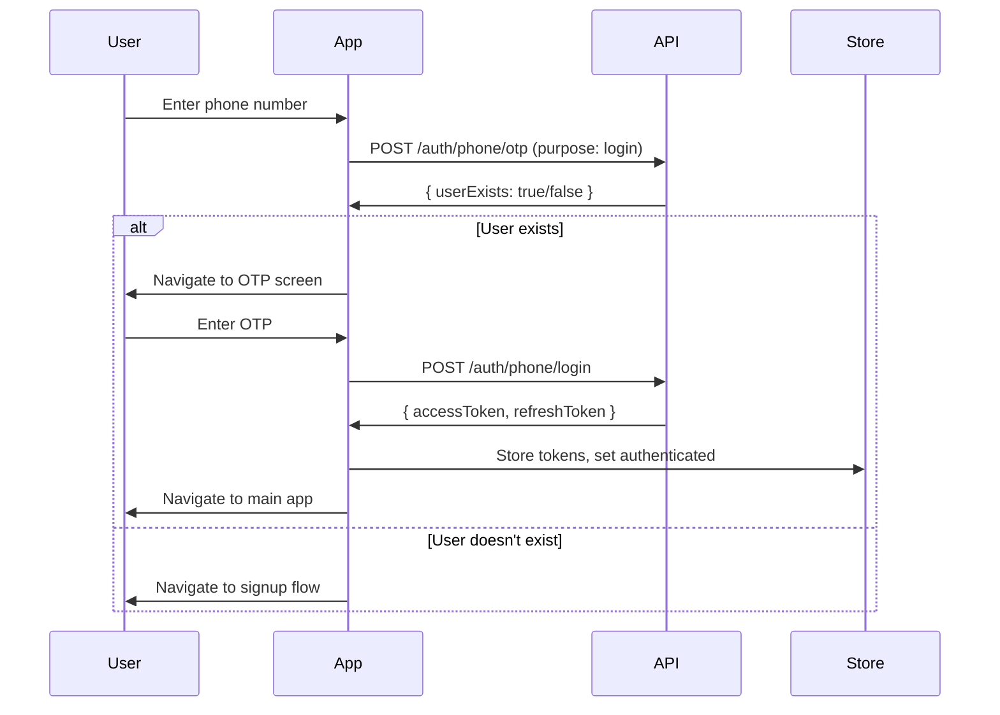
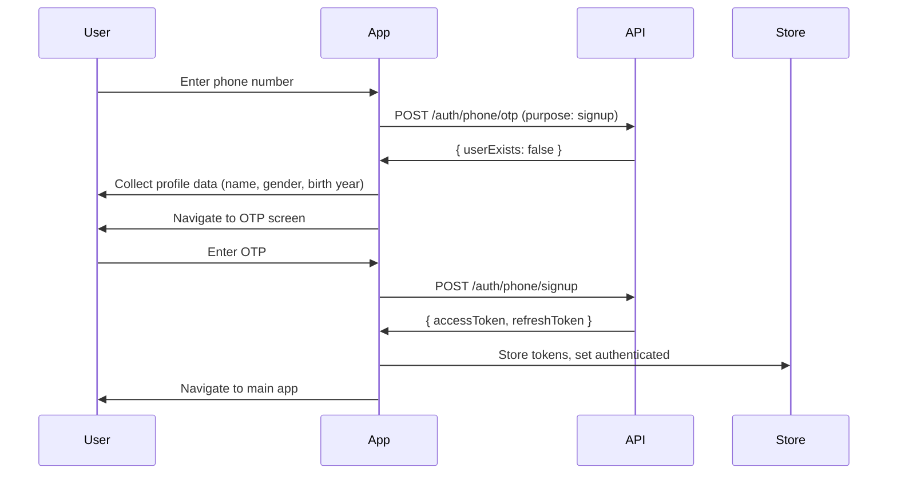

# Authentication Package Guide

## Overview

The `@the/auth/expo` package provides a comprehensive OTP-based authentication system for Expo/React Native applications. It fully integrates with the [Hono API](../../../apps/api) and provides secure, user-friendly authentication with automatic token refresh and robust error handling.

## Installation

```bash
# Add to your app's package.json
pnpm add @the/auth/expo

# Or if using npm
npm install @the/auth/expo
```

## Quick Start

### Using Hooks (Recommended)

The package provides hooks for building custom authentication UI:

```typescript
import {
	usePhoneSignIn,
	useGoogleSignIn,
	useAppleSignIn,
	useSignupFlow,
	useOtpFlow,
	useAuthStore,
} from "@the/auth/expo"

// Phone sign-in hook
const { form, isLoading, handleSendOtp } = usePhoneSignIn()

// Google sign-in hook
const { isLoading, handleGoogleSignIn } = useGoogleSignIn()

// Apple sign-in hook
const { isLoading, isAvailable, handleAppleSignIn } = useAppleSignIn()

// Signup flow hook
const { currentStep, form, handleNext, handleBack } = useSignupFlow(params)

// OTP flow hook
const { resendTimer, handleVerifyOtp, handleResendOtp } = useOtpFlow(params)

// Auth store
const { isAuthenticated, isLoading, error } = useAuthStore()
```

### Using Service Functions Directly

You can also use the service functions directly:

```typescript
import {
	useAuthStore,
	sendOtp,
	signInWithPhone,
	signUpWithPhone,
	logOut,
	api,
} from "@the/auth/expo"

// Use the auth store
const { isAuthenticated, isLoading, error } = useAuthStore()

// Send OTP
const { userExists } = await sendOtp({
	phone: "9876543210",
	purpose: "login",
})

// Login
await signInWithPhone({ phone: "9876543210", code: "123456" })

// Signup
await signUpWithPhone({
	phone: "9876543210",
	code: "123456",
	name: "John Doe",
	gender: "male",
	birthYear: 1990,
})

// Logout
await logOut()

// Make API calls
const response = await api.get("~/user/profile")
```

## Using Authentication Hooks

The package provides hooks for building custom authentication UI. This follows a **headless architecture** where the package provides logic and your app controls the UI.

### Available Hooks

- **`usePhoneSignIn()`** - Phone number sign-in with OTP
- **`useGoogleSignIn()`** - Google OAuth sign-in
- **`useAppleSignIn()`** - Apple OAuth sign-in (iOS only)
- **`useSignupFlow(params)`** - Multi-step signup flow
- **`useOtpFlow(params)`** - OTP verification flow

### Example: Building a Login Screen

```typescript
import { usePhoneSignIn, useGoogleSignIn, useAppleSignIn } from "@the/auth/expo"
import { Button, TextInput } from "@the/ui/expo"

export default function Login() {
  const phoneSignIn = usePhoneSignIn()
  const googleSignIn = useGoogleSignIn()
  const appleSignIn = useAppleSignIn()

  return (
    <View>
      {/* Phone Sign-In */}
      <TextInput
        value={phoneSignIn.form.data.phone}
        onChangeText={(value) => phoneSignIn.form.set("phone", value)}
      />
      <Button onPress={phoneSignIn.handleSendOtp} disabled={phoneSignIn.isLoading}>
        Continue
      </Button>

      {/* Google Sign-In */}
      <Button onPress={googleSignIn.handleGoogleSignIn} disabled={googleSignIn.isLoading}>
        Sign in with Google
      </Button>

      {/* Apple Sign-In (iOS only) */}
      {appleSignIn.isAvailable && (
        <Button onPress={appleSignIn.handleAppleSignIn} disabled={appleSignIn.isLoading}>
          Sign in with Apple
        </Button>
      )}
    </View>
  )
}
```

## Authentication Flow

### 1. Initial Authentication (OTP Flow)

**Login Flow:**



**Signup Flow:**



### 2. Token Management

**Automatic Token Refresh:**

The package implements a sophisticated token refresh system. For detailed implementation, see the [API Integration Guide](api.md#token-refresh-strategy).

**Key Features:**

- **Proactive Refresh**: Tokens refreshed before expiration
- **Reactive Refresh**: Automatic retry on 401 errors
- **Secure Storage**: Tokens stored in device secure storage
- **Automatic Logout**: Invalid tokens trigger immediate logout

## Implementation Details

### State Management (Zustand)

The authentication state is managed using Zustand with secure storage persistence:

```typescript
// Core authentication state (persists)
interface AuthState {
	accessToken: string | null
	refreshToken: string | null
	isAuthenticated: boolean
	isAuthLoading: boolean // Loading auth state from secure storage
}

// UI state (doesn't persist)
interface UIState {
	isLoading: boolean
	error: string | null
}
```

**Key Features:**

- **Secure Storage**: Tokens stored using `expo-secure-store`
- **Partial Persistence**: Only core auth state persists, UI state resets
- **Loading States**: Separate loading states for auth initialization and UI operations
- **Error Handling**: Centralized error state management

### API Integration

**Request Interceptors:**

- Automatically injects `Authorization: Bearer <token>` headers
- Proactive token refresh before requests
- Route protection using `~` prefix for private endpoints

**Response Interceptors:**

- Automatic token refresh on 401 responses
- Logout on invalid/expired refresh tokens
- Structured error handling with consistent error responses

### Device Information

The package automatically collects and sends device information for security tracking:

```typescript
{
  os: "ios" | "android",
  osVersion: string,
  model: string,
  brand: string,
  deviceYearClass: number | null,
  appVersion: string,
  buildNumber: string
}
```

## Package Structure

```
@the/auth/expo/
├── src/
│   ├── index.ts         # Main exports
│   ├── api.ts           # Axios client + token management
│   ├── service.ts       # Auth service functions
│   ├── store.ts         # Zustand store
│   ├── types.ts         # TypeScript type definitions
│   ├── util.ts          # Error handling utilities
│   ├── config.ts        # Configuration types
│   ├── constants.ts     # Centralized constants (routes, timings)
│   └── hooks/           # Authentication hooks
│       ├── usePhoneSignIn.ts
│       ├── useGoogleSignIn.ts
│       ├── useAppleSignIn.ts
│       ├── useSignupFlow.ts
│       ├── useOtpFlow.ts
│       └── utils.ts     # Shared hook utilities (error merging, navigation)
├── docs/
│   ├── auth.md          # This file
│   ├── api.md           # API client documentation
│   └── oauth.md         # OAuth setup guide
└── package.json
```

## Architecture

This package follows a **headless architecture** pattern where business logic is provided via hooks, and the application controls all UI/styling.

### Architecture Principles

#### 1. Separation of Concerns

- **Package (`@the/auth/expo`)**: Business logic, state management, API calls, validation
- **App (`apps/mobile`)**: UI, styling, layout, text content, navigation structure

#### 2. Headless Components Pattern

All authentication flows are provided as hooks:

- `useSignupFlow()` - Multi-step signup logic
- `useOtpFlow()` - OTP verification logic
- `usePhoneSignIn()` - Phone number sign-in logic
- `useGoogleSignIn()` - Google OAuth sign-in logic
- `useAppleSignIn()` - Apple OAuth sign-in logic

The app uses these hooks to build custom UI that matches its design system.

#### 3. Centralized Navigation Paths

**Architectural Decision**: Navigation paths are centralized in `src/constants.ts` for consistency and maintainability.

The following routes are defined in `AUTH_ROUTES`:

- `"/(auth)/login"` - Login screen
- `"/(auth)/signup"` - Signup screen
- `"/(auth)/otp"` - OTP verification screen
- `"/"` - Home/main app screen (after successful auth)

**Rationale**:

- **DRY Principle**: Single source of truth for all navigation paths
- **Consistency**: All hooks use the same routes via helper functions
- **Maintainability**: Easy to update routes in one place
- **Type Safety**: Routes are defined as constants with `as const` for type safety
- Aligns with Expo Router's file-based routing convention
- Most apps will use this structure anyway

**Trade-off**: This couples the package to Expo Router's routing structure, but this is acceptable given:

1. The package is Expo-specific (`@the/auth/expo`)
2. Expo Router is the standard routing solution for Expo apps
3. The simplicity benefit outweighs the coupling cost
4. **Improved**: Centralizing routes reduces duplication and makes changes easier

#### 4. Direct Expo Router Usage

The package directly imports and uses `router` from `expo-router`. This is intentional:

- No abstraction layer needed (simpler code)
- Direct dependency on Expo Router (acceptable for Expo-specific package)
- Aligns with preference for simplicity

### Future Considerations

If multiple apps need different routing structures:

1. Make `AUTH_ROUTES` configurable via package initialization
2. Pass navigation callbacks as hook parameters
3. Create app-specific wrapper hooks

For now, the centralized paths provide the best simplicity-to-flexibility ratio.

## Route Protection

**Expo Router Integration:**

```typescript
// Root layout with route protection
<Stack screenOptions={{ headerShown: false }}>
  {/* Auth routes - only accessible when NOT authenticated */}
  <Stack.Protected guard={!isAuthenticated}>
    <Stack.Screen name="(auth)" />
  </Stack.Protected>

  {/* App routes - only accessible when authenticated */}
  <Stack.Protected guard={isAuthenticated}>
    <Stack.Screen name="(tabs)" />
  </Stack.Protected>
</Stack>
```

## Security Features

### Token Security

- **Access Tokens**: Short-lived JWT tokens (30 minutes)
- **Refresh Tokens**: Long-lived secure tokens (30 days)
- **Automatic Rotation**: Tokens refreshed on successful refresh
- **Secure Storage**: Tokens stored in device secure storage

### OTP Security

- **Rate Limiting**: 1-minute cooldown between OTP requests
- **Attempt Limiting**: Maximum 3 failed attempts per OTP
- **Purpose Validation**: Different logic for login vs signup
- **Automatic Cleanup**: Expired OTPs automatically removed

### Device Tracking

- **Comprehensive Device Info**: OS, model, version tracking
- **Security Monitoring**: Device information for suspicious activity detection
- **User Experience**: Personalized experience based on device capabilities

## Error Handling

### Authentication Errors

- **401 EXPIRED_TOKEN**: Automatic refresh and retry
- **401 INVALID_TOKEN**: Redirect to login
- **401 INVALID_REFRESH_TOKEN**: Logout and redirect to login
- **422 VALIDATION_ERROR**: Display validation details to user

### Network Errors

- **Network Connectivity**: Graceful handling of network failures
- **Timeout Handling**: 5-second timeout with retry logic
- **Offline Support**: Clear error messages for offline scenarios

## Development Features

### Dev Menu Integration

The package includes development tools for debugging authentication:

- **Get Device Info**: Log current device information
- **Log Auth Store**: Display current authentication state
- **Clear Auth Storage**: Reset authentication state

### Logging

- **Structured Logging**: Consistent log format across the app
- **Error Tracking**: Automatic error formatting and logging
- **Development Mode**: Enhanced logging in development builds

## Best Practices

### Token Management

1. **Never store tokens in plain text**
2. **Use secure storage for persistence**
3. **Implement proper token refresh**
4. **Handle refresh failures gracefully**

### Error Handling

1. **Provide user-friendly error messages**
2. **Log security issues appropriately**
3. **Implement graceful degradation**
4. **Handle network failures gracefully**

### Security

1. **Validate all inputs**
2. **Use HTTPS for all API calls**
3. **Implement proper logout**
4. **Monitor for suspicious activity**

## Integration with Backend

The package fully complies with the [Hono API authentication system](../../../apps/api/docs/auth.md):

- **Shared Types**: Uses `@the/types` package for type safety
- **Consistent Error Handling**: Matches backend error response format
- **Device Information**: Sends comprehensive device data
- **Token Management**: Implements same token refresh strategy
- **OTP Flow**: Follows backend OTP validation and rate limiting

## Environment Configuration

The package requires the following environment variable:

```typescript
// .env
EXPO_PUBLIC_API_URL=https://api.topinspect.app
```

For development, you can use:

```typescript
EXPO_PUBLIC_API_URL=https://api.localtest.cc
```

### OAuth Provider Setup

If you're using Google or Apple Sign-In, you'll need to configure OAuth clients:

- **Google Sign-In**: See [OAuth Setup Guide](./oauth.md) for detailed instructions
- **Apple Sign-In**: See [OAuth Setup Guide](./oauth.md) for detailed instructions

Required environment variables:

- `EXPO_PUBLIC_GOOGLE_WEB_CLIENT_ID` (for Android)
- `EXPO_PUBLIC_GOOGLE_IOS_CLIENT_ID` (for iOS)
- `EXPO_PUBLIC_GOOGLE_IOS_URL_SCHEME` (for iOS)

## Dependencies

The package depends on:

- `@the/types` - Shared type definitions
- `@the/utils/expo` - Expo utilities
- `axios` - HTTP client
- `jwt-decode` - JWT token decoding
- `zustand` - State management
- `expo-secure-store` - Secure storage

## TypeScript Support

The package is fully typed and exports all necessary types:

```typescript
import type { AuthStore, AuthState, UIState } from "@the/auth/expo"
```
